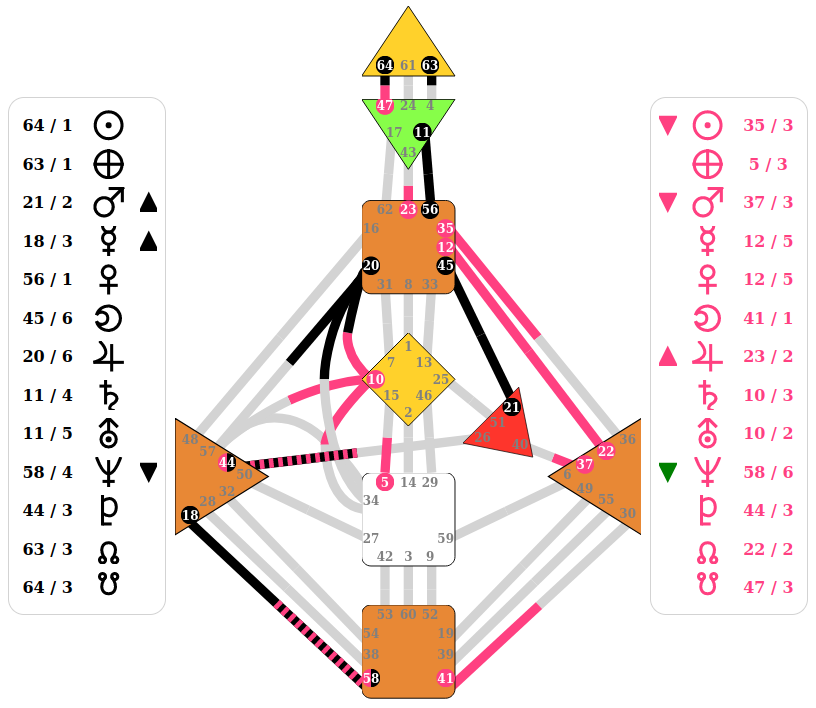

# SharpAstrology.HumanDesign.BlazorComponents - A Blazor component library for SharpAstrology.HumanDesign

The goal of this package is to provide typical human design components. Contributions for alternative charts are welcome.

## How to use the chart in Blazor?
```C#
@using SharpAstrology.DataModels
@using SharpAstrology.Enums
@using SharpAstrology.Ephemerides
@using SharpAstrology.HumanDesign.BlazorComponents

<PageTitle>Human Design Chart Example</PageTitle>


<div style="display: flex; flex-direction: row; height: 700px; align-items: center; justify-content: space-between; max-width: 800px">
    
    <HumanDesignActivations Activations="chart.PersonalityActivation" Height="500px" PlanetsRight="false"
                            States="chart.PersonalityFixation"/>
    
    <HumanDesignGraph Chart="chart"
                      CenterColorMap="centerColorMap"
                      FirstComparerColor="@firstComparerColor"
                      SecondComparerColor="@secondComparerColor"
    />
        
    <HumanDesignActivations Activations="chart.DesignActivation" Height="500px" PlanetsRight="true"
                            States="chart.DesignFixation" Color="#ff4081" ChangedByComparatorColor="green"/>
</div>


@code
{
    [Inject] SwissEphemeridesService EphService { get; set; }
    private HumanDesignChart chart;
    
    // These are the default colors and optional parameters.
    private readonly string firstComparerColor = "#000000";
    private readonly string secondComparerColor = "#ff4081";
    private Dictionary<Centers, string> centerColorMap = new()
    {
            [Centers.Root] = "#E88835",
            [Centers.Sacral] = "#FE352C",
            [Centers.Emotions] = "#E88835",
            [Centers.Spleen] = "#E88835",
            [Centers.Heart] = "#FE352C",
            [Centers.Self] = "#FFD12B",
            [Centers.Throat] = "#E88835",
            [Centers.Mind] = "#87FE49",
            [Centers.Crown] = "#FFD12B"
    };
    
    
    protected override void OnInitialized()
    {
        using var eph = EphService.CreateContext();
        chart = new HumanDesignChart(new DateTime(1988, 9, 4, 1, 15, 0, DateTimeKind.Utc), eph);
    }
}
```
