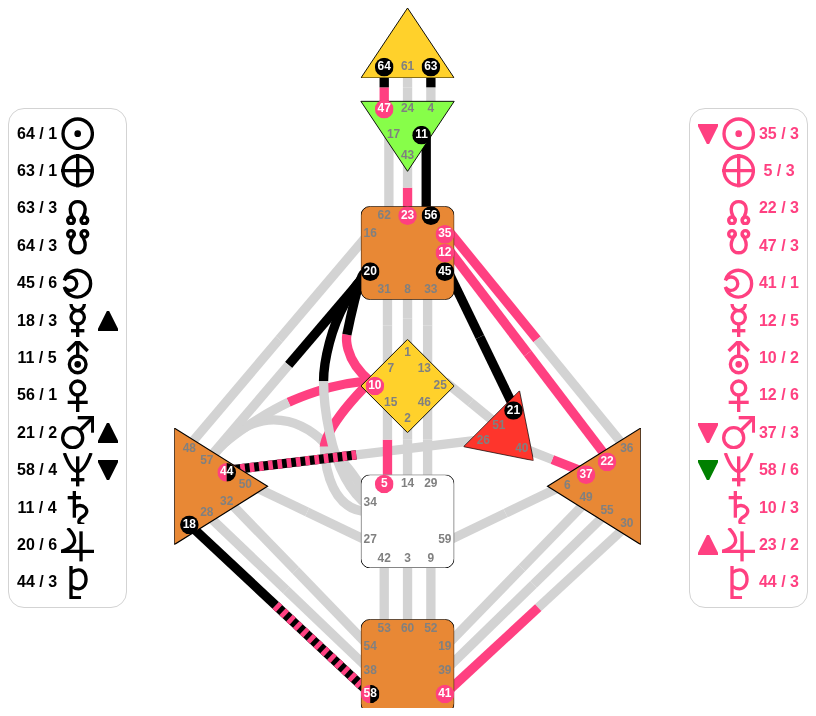

# SharpAstrology.HumanDesign.BlazorComponents - A Blazor component library for SharpAstrology.HumanDesign

The goal of this package is to provide typical human design components. Contributions for alternative charts are welcome.

## SharpAstrology Packages
| Package                                                                                                                | Description                                            | Licence  |
|:-----------------------------------------------------------------------------------------------------------------------|:-------------------------------------------------------|:--------:|
| [SharpAstrology.Base](https://github.com/CReizner/SharpAstrology.Base)                                                 | Base library                                           |   MIT    |
| [SharpAstrology.SwissEph](https://github.com/CReizner/SharpAstrology.SwissEph)                                         | Ephemerides package based on SwissEphNet               | AGPL-3.0 |
| [SharpAstrology.Symbols.BlazorComponents](https://github.com/CReizner/SharpAstrology.Symbols.BlazorComponents)         | Astrological symbols as Blazor components              |   MIT    |
| [SharpAstrology.HumanDesign](https://github.com/CReizner/SharpAstrology.HumanDesign)                                   | Extensions for the Human Design system                 |   MIT    |
| [SharpAstrology.HumanDesign.BlazorComponents](https://github.com/CReizner/SharpAstrology.HumanDesign.BlazorComponents) | Human Design charts as Blazor components               |   MIT    |
| [SharpAstrology.Vedic](https://github.com/CReizner/SharpAstrology.Vedic)                                               | Extensions for Vedic astrology systems                 |   MIT    |
| [SharpAstrology.Vedic.BlazorComponents](https://github.com/CReizner/SharpAstrology.Vedic.BlazorComponents)             | Vedic astrology charts as Blazor components            |   MIT    |
| [SharpAstrology.West](https://github.com/CReizner/SharpAstrology.West)                                                 | Extensions for western astrology systems               |   MIT    |
| [SharpAstrology.West.BlazorComponents](https://github.com/CReizner/SharpAstrology.West.BlazorComponents)               | Western astrology charts as Blazor components          |   MIT    |
| [SharpAstrology.WebApp](https://github.com/CReizner/SharpAstrology.WebApp)                                             | Blazor Server app built on the SharpAstrology packages | AGPL-3.0 |

## How to use the chart in Blazor?
```razor
@using SharpAstrology.DataModels
@using SharpAstrology.Enums
@using SharpAstrology.Ephemerides
@using SharpAstrology.HumanDesign.BlazorComponents

<PageTitle>Human Design Chart Example</PageTitle>


<div style="display: flex; flex-direction: row; height: 700px; align-items: center; justify-content: space-between; max-width: 800px">
    
    <HumanDesignActivations Activations="chart.PersonalityActivation" Height="500px" PlanetsRight="false"
                            States="chart.PersonalityFixation"/>
    
    <HumanDesignGraph Chart="chart"
                      CenterColorMap="centerColorMap"
                      FirstComparerColor="@firstComparerColor"
                      SecondComparerColor="@secondComparerColor"
                      OnGateClick="OnGateClick"
    />
        
    <HumanDesignActivations Activations="chart.DesignActivation" Height="500px" PlanetsRight="true"
                            States="chart.DesignFixation" Color="#ff4081" ChangedByComparatorColor="green"/>
</div>


@code
{
    [Inject] SwissEphemeridesService EphService { get; set; }
    private HumanDesignChart chart;
    
    // These are the default colors and optional parameters.
    private readonly string firstComparerColor = "#000000";
    private readonly string secondComparerColor = "#ff4081";
    private Dictionary<Centers, string> centerColorMap = new()
    {
            [Centers.Root] = "#E88835",
            [Centers.Sacral] = "#FE352C",
            [Centers.Emotions] = "#E88835",
            [Centers.Spleen] = "#E88835",
            [Centers.Heart] = "#FE352C",
            [Centers.Self] = "#FFD12B",
            [Centers.Throat] = "#E88835",
            [Centers.Mind] = "#87FE49",
            [Centers.Crown] = "#FFD12B"
    };
    
    
    protected override void OnInitialized()
    {
        using var eph = EphService.CreateContext();
        chart = new HumanDesignChart(new DateTime(1988, 9, 4, 1, 15, 0, DateTimeKind.Utc), eph);
    }

    private void OnGateClick(Gates gate) => Console.WriteLine($"Gate {gate.ToNumber()} was clicked.");
}
```


## The parameters of HumanDesignGraph

| Parameter              | Default                 | Meaning                                                                                     |
|:-----------------------|:------------------------|:--------------------------------------------------------------------------------------------|
| `Chart`                | required                | The chart that is drawn.                                                                    |
| `Width`, `Height`      | `auto`, `100%`          | Width and height of the outer svg element.                                                  |
| `FirstComparerColor`   | `#000000`               | Colour of everything the first comparator activates.                                        |
| `SecondComparerColor`  | `#ff4081`               | Colour of everything the second comparator activates.                                       |
| `InactiveChannelColor` | `lightgrey`             | Colour of a channel half that no comparator activates.                                      |
| `CenterColorMap`       | `DefaultCenterColorMap` | Fill of the defined centers. A center the map leaves out falls back to the default map.     |
| `UndefinedCenterColor` | `white`                 | Fill of a center that is not defined.                                                       |
| `IdPrefix`             | empty                   | Written in front of the id of every center and gate. Empty means no ids are written at all. |
| `OnGateClick`          | none                    | Raised with the clicked `Gates` value.                                                      |
| `OnChannelClick`       | none                    | Raised with the clicked `Channels` value.                                                   |
| `OnCenterClick`        | none                    | Raised with the clicked `Centers` value.                                                    |

Centers and gates always carry a `data-center` and a `data-gate` attribute. `data-center` holds the name of the
center, `data-gate` the number of the gate. Both may appear more than once on a page, which is why they are data
attributes and not ids. Set `IdPrefix` if you need real ids, for example `IdPrefix="left-"` and `IdPrefix="right-"`
for two charts next to each other.
